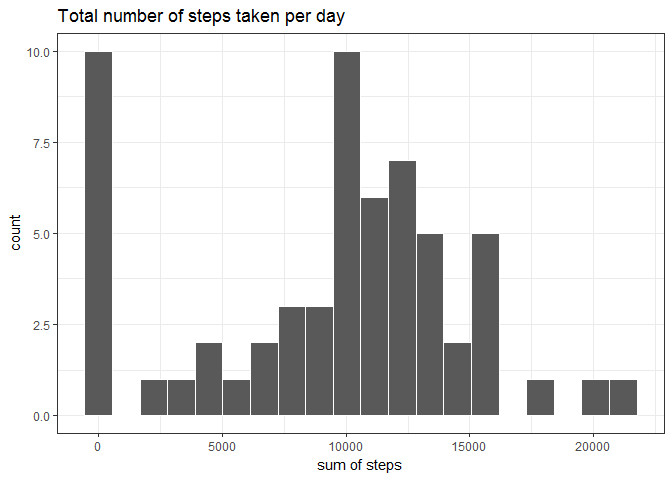

# Reproducible Research: Peer Assessment 1


## Loading and preprocessing the data

We start by loading useful libraries.


```r
library(dplyr)
library(ggplot2)
library(Hmisc)
set.seed(07122017)
```

Next we load the data from a file (the working directory is set on the folder with the data).


```r
df <- read.csv("activity.csv")
```

Now we examine our data.


```r
str(df)
```

```
## 'data.frame':	17568 obs. of  3 variables:
##  $ steps   : int  NA NA NA NA NA NA NA NA NA NA ...
##  $ date    : Factor w/ 61 levels "2012-10-01","2012-10-02",..: 1 1 1 1 1 1 1 1 1 1 ...
##  $ interval: int  0 5 10 15 20 25 30 35 40 45 ...
```

We can see that we have three variables. For further analysis, it might be helpful to convert `date` column from factor to date format.


```r
df$date <- as.Date(df$date, format="%Y-%m-%d")
```

Now we can see that our data is in proper format:


```r
str(df)
```

```
## 'data.frame':	17568 obs. of  3 variables:
##  $ steps   : int  NA NA NA NA NA NA NA NA NA NA ...
##  $ date    : Date, format: "2012-10-01" "2012-10-01" ...
##  $ interval: int  0 5 10 15 20 25 30 35 40 45 ...
```

## What is mean total number of steps taken per day?

We aggregate the data by days, summing the number of steps taken oven intervals (NA values ommited).
With such aggregated data data we make a histogram of total number of steps.


```r
steps_day <- df %>% group_by(date) %>% summarise(steps=sum(steps, na.rm=T))
ggplot(steps_day, aes(x=steps)) + 
    geom_histogram(bins=20, color="white") + theme_bw() +
    labs(x="sum of steps", y="count") + 
    ggtitle("Total number of steps taken per day")
```

<!-- -->

The mean number of steps on aggregated data is 9354.2295082
and the median is 10395.

## What is the average daily activity pattern?

We aggregate the data by intervals, averaging the number of steps taken over days (NA values ommited).
With such aggregated data we make a time series of number of mean number of steps.


```r
steps_interval <- df %>% group_by(interval) %>% 
    summarise(steps=mean(steps, na.rm=T))
ggplot(steps_interval, aes(x=interval, y=steps)) + 
    geom_line(size=1, alpha=0.8) + theme_bw() +
    labs(x="interval", y="mean of steps") + 
    ggtitle("Average number of steps taken per interval")
```

<!-- -->

The maximum value is obtained by 835 interval.

## Imputing missing values

We apply a function to each column of data frame to count number of missing values.
It turns out that we have 2304 missing rows.


```r
apply(is.na(df), 2, sum)
```

```
##    steps     date interval 
##     2304        0        0
```

We will try to impute missing values by the already calculated daily mean values.
The filled data frame will be named `df_filled`.


```r
df_filled <- df
missing <- which(is.na(df$steps))
for (i in missing){
    interv <- df_filled$interval[i]
    df_filled[i,"steps"] <- steps_interval[steps_interval$interval==interv, "steps"]
}
```

We can see that the imputting was succesfull as now we have 2304 missing values. 
Lets plot a histogram for daily total number of steps again and check whether it is different.


```r
steps_day2 <- df_filled %>% group_by(date) %>% 
    summarise(steps=sum(steps))
ggplot(steps_day2, aes(x=steps)) + 
    geom_histogram(bins=20, color="white") + theme_bw() +
    labs(x="sum of steps", y="count") + 
    ggtitle("Total number of steps taken per day with imputed NAs")
```

<!-- -->

We can see that the distribution has shifted to the right. We got rid of many near-zero sums. The missing values were understating the daily total number of steps. The distribution looks also more gaussian.

Our mean is now about 1.0766189\times 10^{4} and the median is about 1.0766189\times 10^{4}.
Both these values has increased. Interesting that now the mean and median are exacly the same. It is because now each date is averaged over the same number of intervals.

## Are there differences in activity patterns between weekdays and weekends?

We add new variable to the filled data frame, indicating whether it is a weekday or weekend day.


```r
df_filled$day <- weekdays(df_filled$date)
df_filled <- df_filled %>% mutate(day=df_filled$day %in% c("sobota","niedziela"))
df_filled$day <- as.factor(df_filled$day)
levels(df_filled$day) <- c("weekday", "weekend")
```

Now we can again aggregate our data frame by intervals, but this time we do it separately for weekdays and weekend days. Then we will plot the results.


```r
steps_interval2 <- df_filled %>% group_by(interval, day) %>% 
    summarise(steps=mean(steps))
ggplot(steps_interval2, aes(x=interval, y=steps)) + 
    geom_line(size=1, alpha=0.8) + theme_bw() + facet_grid(day~.) +
    labs(x="interval", y="mean of steps") + 
    ggtitle("Average number of steps taken per interval per day type with imputed NAs")
```

<!-- -->

It looks like during week, number of steps is high early on and then it is relatively low. On the other side, during weekend, the activity early is much lower but it gets relatively high later. It looks reasonable if we assume that people who gathered this data were working during week, with free weekend.
